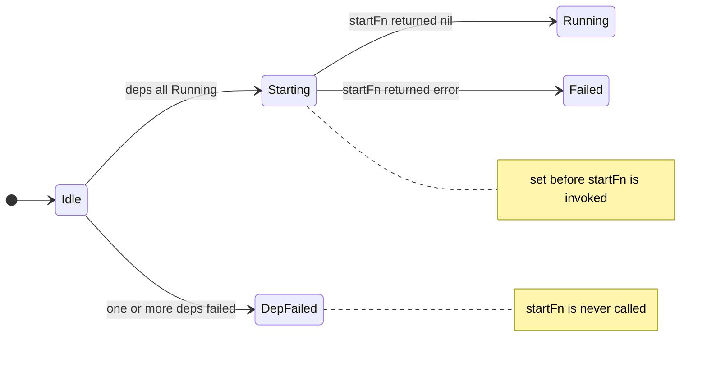
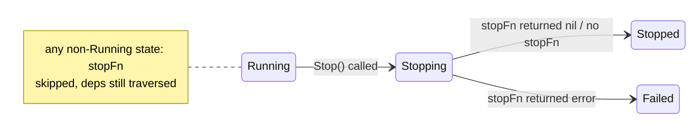

# loom

`loom` is a small Go library for managing the startup and shutdown of interdependent services. You describe each service as an `Service` — giving it a name, a start function, an optional stop function, and a list of services it depends on — and the library handles the rest: starting dependencies before their dependents, running independent branches of the graph concurrently, ensuring a shared dependency used by multiple services starts and stops exactly once, and collecting every failure with full attribution back to its source. There are no goroutine supervisors, no message buses, no reflection, and no external dependencies. If your project has grown beyond a flat `errgroup` but doesn't need a full dependency-injection framework, this is the gap it fills.

---

## Features

- **Dependency-ordered startup** — an service's `startFn` is never called until every service in its `deps` list has reached `Running`
- **Concurrent independent branches** — sibling dependencies start in parallel; the overall startup is as fast as the longest critical path
- **Diamond-safe** — a shared dependency referenced by multiple services starts and stops exactly once, regardless of how many services hold a pointer to it
- **Full error accumulation** — when multiple dependencies fail simultaneously, all errors are collected and returned together, each attributed to the named dependency that produced it
- **Attributed errors** — every dependency failure is wrapped as `dep "name": <original error>`, so the failure chain is readable without spelunking through logs
- **Precise lifecycle states** — status transitions through `Idle → Starting → Running` and `Running → Stopping → Stopped`, with `Failed` and `DepFailed` as terminal error states, all readable without a lock
- **Per-service timeouts** — each service carries its own `time.Duration` grace period applied independently to both its `startFn` and `stopFn` via a derived child context
- **Best-effort shutdown** — a failed or timed-out `stopFn` is logged and recorded but never blocks the rest of the graph from stopping
- **Idempotent `Start` and `Stop`** — safe to call multiple times; only the first call executes, subsequent calls return the cached result immediately
- **Restartable** — `Reset` clears all start/stop state so an service can be taken through the lifecycle again

---

## Requirements

Go 1.22 or later. No external dependencies; uses only the standard library.

The `sync.WaitGroup.Go` method and `errors.Join` function (Go 1.20) are both required. All other constructs are stable across older versions.

---

## API

### Types

#### `Service`

The central type. Represents a single service node in the dependency graph. An `Service` holds a name, a mandatory start function, an optional stop function, a timeout, and a slice of dependency pointers. All fields are unexported; construction is done through `New` and the option functions.

#### `Status`

An `int32`-based enumeration of the states a service can occupy. Implements `fmt.Stringer`. The defined values are:

| Constant    | String               | Meaning                                                                 |
|-------------|----------------------|-------------------------------------------------------------------------|
| `Idle`      | `"idle"`             | Initial state. Neither start nor stop has been attempted.               |
| `Starting`  | `"starting"`         | All dependencies reached `Running`; `startFn` is currently executing.  |
| `Running`   | `"running"`          | `startFn` returned `nil`.                                               |
| `Stopping`  | `"stopping"`         | `stopFn` is currently executing.                                        |
| `Stopped`   | `"stopped"`          | `stopFn` returned `nil`, or no `stopFn` was provided.                  |
| `Failed`    | `"failed"`           | `startFn` or `stopFn` returned a non-nil error.                        |
| `DepFailed` | `"dependency failed"`| One or more dependencies failed to start; `startFn` was never called.  |

#### `Option`

A function type used to configure an `Service` at construction time. Passed as variadic arguments to `New`.

---

### Constructor

#### `New(name string, startFn func(ctx context.Context) error, opts ...Option) *Service`

Creates and returns a new `Service`. `name` is used in log output and error attribution. `startFn` is required and is the function called to bring the service up; it must respect context cancellation and return `nil` on success. Zero or more `Option` values may follow to set the stop function, timeout, and dependencies. The returned service begins in the `Idle` state.

---

### Options

#### `WithDeps(deps ...*Service) Option`

Declares one or more service that must reach `Running` before this service's `startFn` is called. Accepts a variadic list; multiple calls to `WithDeps` on the same service are additive. The dependency relationship is directional: the service with `WithDeps(x)` depends on `x`, not the reverse.

#### `WithTimeout(d time.Duration) Option`

Sets the grace period applied to both the `startFn` and `stopFn` of this service. When nonzero, a `context.WithTimeout` child is derived from the incoming context before each function is called. The timeout is per-invocation, not shared between start and stop. A zero value (the default) means no additional deadline is imposed; the incoming context's own deadline, if any, still applies.

#### `WithStopFn(fn func(ctx context.Context) error) Option`

Sets the shutdown function. Called during `Stop` if and only if the service previously reached `Running`. If no stop function is provided, the service transitions directly from `Running` through `Stopping` to `Stopped` when `Stop` is called.

---

### Methods

#### `(a *Service) Validate() error`

Performs a depth-first search of the dependency graph rooted at `a` to detect cycles. Returns `nil` if the graph is a valid DAG, or an error naming the full cycle path (e.g., `cycle detected: a -> b -> c -> a`) if not. Should be called once before `Start`. Does not modify any state.

#### `(a *Service) Start(ctx context.Context) error`

Starts the service and, recursively, all of its dependencies. Dependencies at the same level of the graph are started concurrently. An service waits for all of its declared dependencies to reach `Running` before calling its own `startFn`. If any dependency fails, the service transitions to `DepFailed` and returns a joined error containing every failure, each attributed by dependency name. If `startFn` itself fails, the service transitions to `Failed` and returns that error.

The call is idempotent via `sync.Once`: the first caller executes the full startup sequence; every subsequent caller — including concurrent ones — blocks until the first completes and then receives the same stored result. Only the first caller's context is used for the timeout derivation; subsequent calls receive the cached outcome regardless of what context they pass.

#### `(a *Service) Stop(ctx context.Context) error`

Stops the service and, recursively, all of its dependencies. The service's own `stopFn` is called first, but only if the service is currently in `Running` (the transition is performed with a compare-and-swap, so service in any other state are skipped cleanly). After the service's own stop completes — whether successfully or not — all dependencies are stopped concurrently.

Shutdown is best-effort: a `stopFn` that returns an error is logged and recorded, but does not prevent the rest of the graph from stopping. Dependency stop errors are logged but not returned; only the service's own `stopFn` error is surfaced to the caller. The full graph is always traversed.

Like `Start`, the call is idempotent; the first caller executes and all subsequent callers receive the stored result.

#### `(a *Service) Reset()`

Clears all start and stop state — the `sync.Once` instances, cached errors, and status — returning the service to `Idle`. After `Reset`, the service can be passed through `Start` and `Stop` again. **Must not be called concurrently with `Start` or `Stop`.** `Reset` is local to the service it is called on; dependencies are not reset automatically. Callers that want to restart a full graph are responsible for calling `Reset` on each node.

#### `(a *Service) Status() Status`

Returns the service's current `Status`. Reads the underlying `atomic.Int32` directly; safe to call from any goroutine at any time without a lock.

---

## Lifecycle & State Machine

### Start transitions



The `Starting` state is set immediately before `startFn` is invoked, so a service's status is never ambiguously `Idle` while its start function is executing.

### Stop transitions



---

## Dependency Graph Semantics

Dependencies form a directed acyclic graph (DAG). The `Validate` method enforces the acyclic constraint before any startup attempt.

**Concurrent starts.** When a service starts, all of its direct dependencies are launched in parallel. Each of those, in turn, launches their own dependencies in parallel. The effective startup order is a concurrent topological sort: siblings fan out, and each service blocks only until all nodes it directly declared as dependencies are ready.

**Diamond safety.** When the same service appears in the dependency lists of two or more service (a diamond in the graph), `sync.Once` ensures its `startFn` is called exactly once. The second goroutine to reach it blocks on the `Once` until the first completes and then receives the same result. This is correct for both the success and failure cases.

**Stop ordering.** `Stop` stops the caller's own `stopFn` first, then fans out to all declared dependencies concurrently. Since `Stop` is called top-down from the root, this naturally produces a reverse-topological ordering: consumers are torn down before the services they depend on.

---

## Error Handling

### Start errors

If any subset of an service's dependencies fail, `Start` collects all of their errors — not just the first — joins them using `errors.Join`, and wraps each with the dependency's name:

```
dep "database": port busy
dep "cache": connection refused
```

The joined error is returned to the caller and the service is marked `DepFailed`. Its own `startFn` is never invoked. Errors are fully unwrappable via `errors.Is` and `errors.As`.

### Stop errors

`Stop` returns only the service's own `stopFn` error, if any. Dependency stop errors are logged via `log.Printf` and attributed by name (`dep "name" stop error: ...`) but are not propagated to the caller. This is intentional: shutdown is best-effort and a failing dependency must not prevent the rest of the graph from completing its teardown.

---

## Context and Timeouts

`Start` and `Stop` both accept a `context.Context`. This context flows down the entire graph as the parent. Each service that has a nonzero timeout derives a `context.WithTimeout` child from it before invoking its `startFn` or `stopFn`. Services without a timeout pass the incoming context through unchanged.

The practical implication is that a short deadline on the root context bounds the entire startup or shutdown, while per-service timeouts provide finer-grained control over individual services within that bound. If the parent context is cancelled mid-startup, all in-progress `startFn` calls will receive cancellation through their derived contexts.

---

## Concurrency Guarantees

| Guarantee | Mechanism |
|---|---|
| `startFn` called at most once per service | `sync.Once` |
| `stopFn` called at most once per service | `sync.Once` |
| `stopFn` called only if service reached `Running` | `atomic.CompareAndSwap` on status |
| `Status()` safe to read from any goroutine | `atomic.Int32` load |
| Status writes are race-free | `atomic.Int32` store / CAS |
| Concurrent dep-start errors collected safely | `sync.Mutex` local to each `start` call |

`Reset` is the one method that is not concurrency-safe with respect to `Start` and `Stop`. It must only be called once any in-flight start or stop has fully returned.
